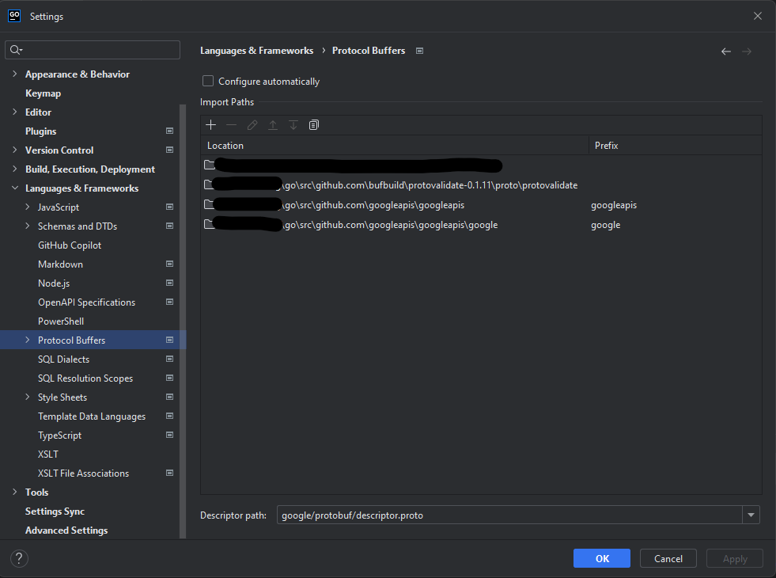

# HAWK

This is a CLI-tool to build microservices with go.

Hawk takes the service definition from a `.proto` file and generates the boilerplate for a server supporting gRPC,
HTTP (with JSON) and WebSocket. [Go-kit](https://github.com/go-kit/kit) is the toolkit of choice.

This project can be considered as the successor of [metaverse/truss](https://github.com/metaverse/truss), the code is
partly taken over.

## Installation

Installing Hawk is straight forward

```shell
go install github.com/niiigoo/hawk@latest
```

### Dependencies

In order to compile the `.proto` file, `protoc` is required
([official installation instruction](https://grpc.io/docs/protoc-installation/)).

In addition, the go specific extensions are necessary:

```shell
go install google.golang.org/protobuf/cmd/protoc-gen-go@latest
go install google.golang.org/grpc/cmd/protoc-gen-go-grpc@latest
```

Update your `PATH` environment variable to contain the location of `protoc` and the go-related binaries
(by default `$(go env GOPATH)/bin`).

## Usage

### Initialize a project

Initializing a project means, generating the `go.mod` file and the `.proto` file containing the basic structure of the
service.

```shell
# Command:
hawk init <repository> <name>
# Example:
hawk init github.com/orga/sample-service sample
```

### Generate boilerplate

#### Service structure

```
Project dir
├── cmd # do not touch
│   ├── <project>
│   │   ├── main.go
├── handlers
│   ├── handlers.go # entrypoint for business logic
│   ├── hooks.go # stop gracefully
│   ├── middleware.go # apply middleware
├── svc # do not touch
├── go.mod
├── go.sum
├── *.proto # define your service
├── *.pb.go # do not touch
```

#### Command

```shell
hawk generate
# Or use a shortcut
hawk gen
hawk g
```

## Logging

Hawk uses [logrus](https://github.com/sirupsen/logrus) as logging framework.
The logger is initialized in `handlers.go` and can be modified.

Request-based logging can be achieved by using the default logging middlewares:

```go
// Log the time it takes to execute the endpoint (business logic)
in.WrapAllLabeledExcept(middleware.EndpointLogging(logger, nil))
// Adds a logger to the context with default fields
in.WrapAllLabeledExcept(middleware.LoggerToContext(logger))
// Adds a logger to the context (or modifies an existing one) with custom fields related to HTTP requests
in.WrapAllWithHttpOptionExcept(middleware.LoggerToContextHTTP(logger, func (r *http.Request) log.Fields {
// TODO: Add custom fields
}
```

Using the configured logger is easy:

```go
func (s testService) TestEndpoint(ctx context.Context, req *pb.Request) (*pb.Response, error) {
// ...
log := middleware.GetLogger(ctx)
log.Info("Hello world")
// {"level":"info","method":"TestEndpoint","msg":"Hello World","request_id":"08b4c2e7-cce1-41c7-aea9-ed243c84d153","service":"test","time":"2023-06-07T19:54:36+02:00","transport":"HTTPJSON","url":"/api/test"}
// ...
}
```

## Transport layers

### gRPC

The gRPC server is always enabled and by default listens on port `5040`.
All methods are exposed.

### HTTP

The HTTP server is always enabled and by default listens on port `5050`.
Only methods with the option `google.api.http` are exposed by the specified path.

Example:

```proto
service Test {
  rpc UpdateUser(UpdateUserRequest) returns (UpdateUserResponse) {
  option(google.api.http) = {
    put: "/user/{id}"
    body: "*"
  };
}
```

Check https://cloud.google.com/endpoints/docs/grpc/transcoding for more information.

#### HTTP compression

Compression can be configured for the whole service and for specific methods by using options in the `.proto` file.
This is an experimental feature and the performance tradeoffs may be high.

The library [httpcompression](https://github.com/CAFxX/httpcompression) is used (licensed under Apache 2.0).

### Websocket

The websocket provider is a subset of the HTTP server. It can be enabled by providing a value for `WebSocketPath`.
The provided path is relative to `HttpPrefix` and is the endpoint to establish a websocket connection.

All methods can be accessed via websocket. The request and response are encoded as JSON.

Request structure:

```json
{
  "method": "UpdateUser",
  "data": {
    "id": "123",
    "name": "John Doe"
  },
  "request_id": "08b4c2e7-cce1-41c7-aea9-ed243c84d153"
}
```

The `request_id` is optional and will be added to the response:

```json
{
  "method": "UpdateUser",
  "status": 200,
  "request_id": "08b4c2e7-cce1-41c7-aea9-ed243c84d153",
  "data": {
    "id": "123",
    "name": "John Doe",
    "age": 42
  }
}
```

The status are the HTTP status codes.

## Proto

### Imports

In case you have other imports, you can create the file `protoc.yaml` in the project root and add the following content:

```yaml
imports:
  - /my/other/import # will be added to the protoc command as -I=/my/other/import
  - /my/next/import  # will be added to the protoc command as -I=/my/next/import
```

### Syntax highlighting

The IDE does not know where to find the imports, therefore, syntax highlighting is not working properly.
To fix this, you can tell your IDE the locations:

| Path                                                  | Prefix     |
|-------------------------------------------------------|------------|
| ${GOPATH}/src/github.com/googleapis/googleapis        | googleapis |
| ${GOPATH}/src/github.com/googleapis/googleapis/google | google     |

That's how it looks like in Goland:


## Potential new features

- Generate documentation
  - Markdown
  - Swagger
- Advanced tools
  - `hawk generate entity <name>`
